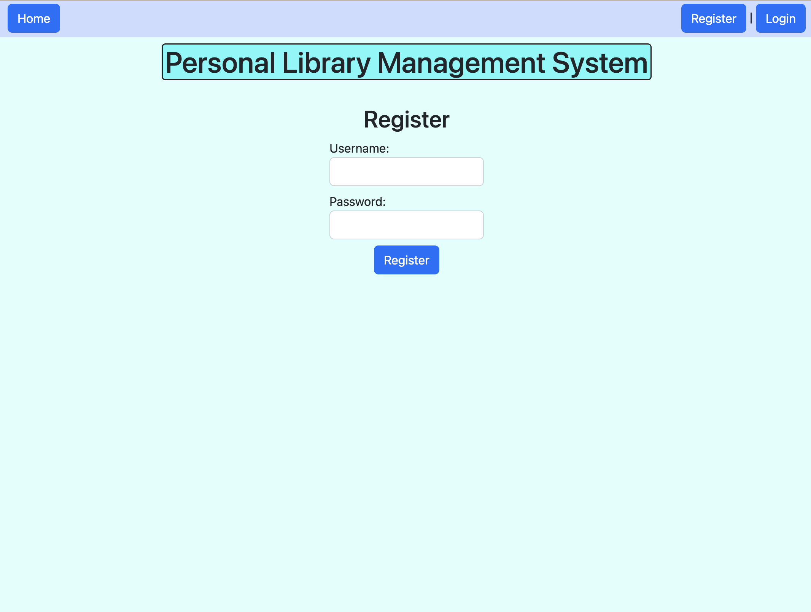
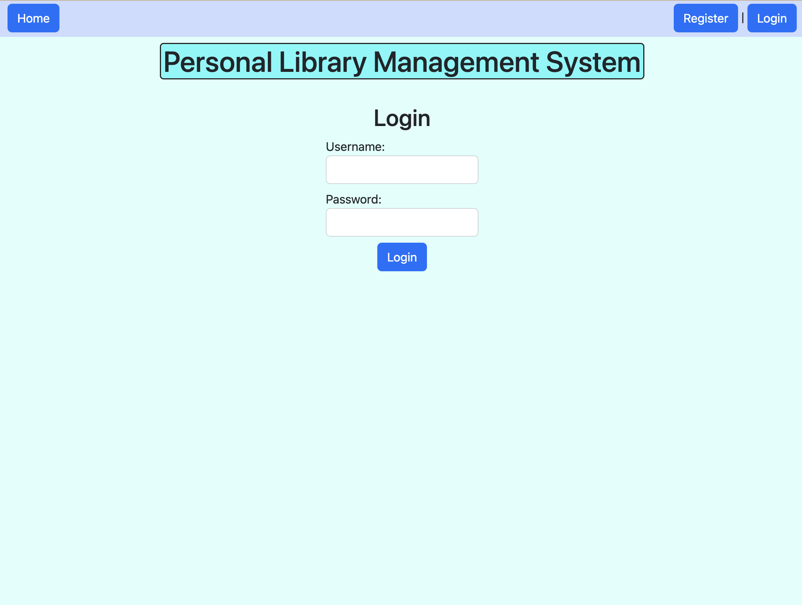
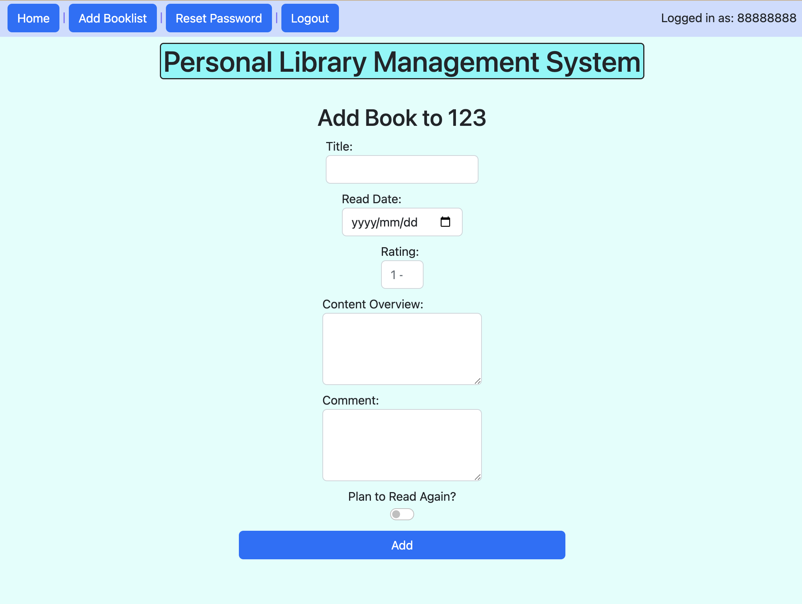
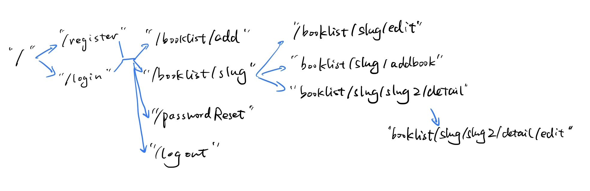
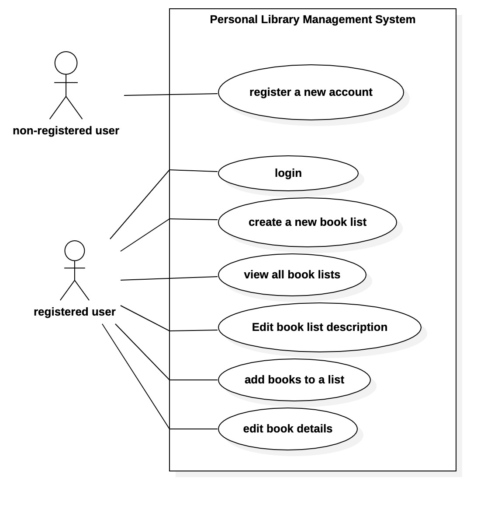

<!-- (__TODO__: your project name) -->

# Personal Library Management System

## Overview

<!-- (__TODO__: a brief one or two paragraph, high-level description of your project) -->

In the rapidly developed world these days, reading books provides people with a peaceful haven that protects us against the influence of such an impetuous and superficial society. Generally, the more one reads, the more one sees, experiences, and knows about themselves.

However, as time goes by, it's always difficult to remember exactly which books were read, what the books wrote about, and what the feeling was last time. Therefore, Personal Library Management System is available here to help!

Personal Library Management System is a web app that allows users to keep track of multiple book lists. Firstly, users can register and log in. Once they're logged in to the system, they can modify profiles, change account preferences, and create or view all their book lists. For every list of books that they have, they can edit the list description and add books to the list. For every book in any arbitrary list, they can edit its details or delete it.

## Data Model

The application will store Users, Books, and Lists.

* users can have multiple lists (via references)
* each list can have multiple books (by embedding array)

An Example User:

```javascript
{
  username: "libraryhost",
  hash: // a password hash,
}
```

An Example List with Embedded Books:

```javascript
{
  user: // a reference to a User object
  name: "Literary Fiction",
  description: "Novels that are character-driven rather than plot-driven, examine the human condition, use language in an experimental or poetic fashion, or are simply considered \"serious\" art.",
  items: [
    { title: "The Great Gatsby",
      time: "09/13/2022",
      rating: 4,
      contentOverview: "The novel depicts first-person narrator Nick Carraway's interactions with mysterious millionaire Jay Gatsby and Gatsby's obsession to reunite with his former lover, Daisy Buchanan",
      comment: "a GREAT book!",
      status: true,
      list: "Literary Fiction"},
    
    { title: "Animal Farm",
      time: "10/02/2022",
      rating: 5,
      contentOverview: "the story of a group of farm animals who rebel against their human farmer, hoping to create a society where the animals can be equal, free, and happy. Ultimately, the rebellion is betrayed, and the farm ends up in a state as bad as it was before, under the dictatorship of a pig named Napoleon.",
      comment: "another GREAT book!",
      status: false,
      list: "Literary Fiction"},
  ],
  createdAt: // timestamp
}
```

## Wireframes

<!-- (__TODO__: wireframes for all of the pages on your site; they can be as simple as photos of drawings or you can use a tool like Balsamiq, Omnigraffle, etc.) -->


/ - home page, showing all book lists


/register - page for register



/login - page for login



/booklist/add - page for creating a new book list


/booklist/slug - page for showing specific book list


/booklist/slug/edit - page for editing the detail of a specific book list


/booklist/slug/addbook - page for adding a new book



/booklist/slug/slug2/detail - page for showing specific book


/booklist/slug/slug2/detail/edit - page for editing the detail of a specific book


/passwordReset - page for resetting the password


/logout - page for processing logging out. If logout successfully, will redirect to main page

no image shown

## Site map



## User Stories or Use Cases



## Research Topics

<!-- (__TODO__: the research topics that you're planning on working on along with their point values... and the total points of research topics listed) -->

* (5 points) Integrate user authentication
    * I'm going to be using passport.js for user authentication
    * It is an authentication middleware for Node.js
    * It does not mount routes or assume any particular database schema, which maximizes flexibility and allows application-level decisions to be made
    
* (3 points) Unit testing with JavaScript
    * It is executed in the browser to test if all functionalities are working as desired during the development cycle
    * It saves time to ensure that all code meets quality standards before being deployed
    * I'm going to be using Unit.js, Mocha, Jest, Jasmine

* (5 points) Automated functional testing for all of routes
    * It is a technique that executes test cases automatically using some specific code during the level of system testing
    * It is crucial for faster software release cycles; it verifies that the application is bug-free and ready for release.
    * I'm going to use Selenium, Rainforest QA, Headless Chrome, and Cypress.

13 points total out of 8 required points. Research topics are subjected to modify. I listed more points since I haven't decided which ones to do... I'm not familiar with any one of those :( 
<!-- (___TODO__: addtional points will __not__ count for extra credit) -->


## Unit Testing Screenshot


## Annotations / References Used

<!-- (__TODO__: list any tutorials/references/etc. that you've based your code off of) -->

1. [passport.js authentication docs](http://passportjs.org/docs)
2. [unit.js](https://unitjs.com)
3. [Mocha](https://mochajs.org)
4. [Jest](https://jestjs.io)
5. [Jasmine](https://jasmine.github.io)
6. [Selenium docs](https://www.selenium.dev/documentation)
7. [Rainforest QA](https://www.rainforestqa.com)
8. [Headless Chrome get started](https://developer.chrome.com/blog/headless-chrome)
9. [Cypress](https://www.cypress.io)